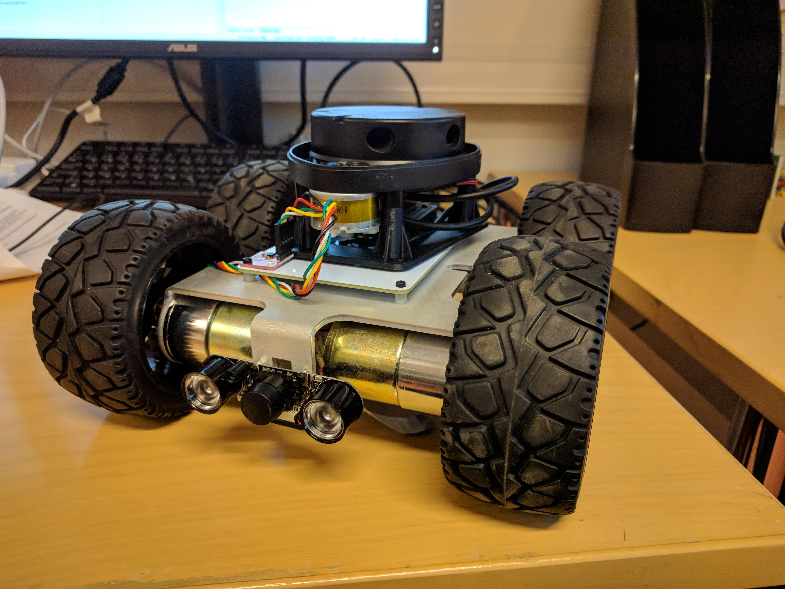

# ROS-package for MonsterBorg
This repository contains a ROS-package for controlling and communicating with MonsterBorg, equipped with a LiDAR, Inertial Measurement Unit (IMU), and a IR fisheye camera.



## Building the package
Copy the package to 'src' directory under your workspace, e.g. catkin_ws/src/. Next, build the package using catkin as follows:

```console
$ cd ~/catkin_ws/
$ catkin_make
```
## Launching the package
robot/launch contains launch files to launch the package with different sensors. All launch files require at least the MonsterBorg itself as well as a controller.
Example of launch file usage:

```console
$ roslaunch robot robot_full.launch
```
NOTE: if launching via ssh, use ```-X``` flag when connecting to enable X11 forwarding (required for joystick control)

## Scripts
The directory robot/scripts contains all the necessary python-scripts to communicate with MonsterBorg:
### cameraPub.py
This script is used for reading data from PiCamera, converting it to a ROS-message of type 'CompressedImage' and publishing this to the ROS-network. The camera resolution and FPS can be configured by changing ```RESOLUTION = (640, 480)``` and framerate with ```FPS = 10```, at the top of the file. 
### imuPub.py
This script is used for reading and publishing data from the IMU sensor. The [RTIMULib2](https://github.com/RTIMULib/RTIMULib2) library is used to configure and create a configuration file for the IMU. The script publishes only the linear acceleration and gyro data, omitting the fusionPose data.
### XVLidar.py
A python class for using the XV LiDAR controller from www.getsurreal.com in a more object oriented way. Available [here](https://github.com/tapioho/XVLidar).
### lidarPub.py
This script uses USB serial connection and the XVLidar class to communicate with the LiDAR. The lidar scans for two full revolutions, and publishes data to the ROS network.
### JoystickControl.py
Used for controlling the MonsterBorg with a (wireless) usb controller. Heavily based on the [Monsterborg joystick control example](https://www.piborg.org/blog/build/monsterborg-build/monsterborg-examples-joystick-control)
### ThunderBorg.py
Functions for controlling the MonsterBorg, available at www.piborg.org
